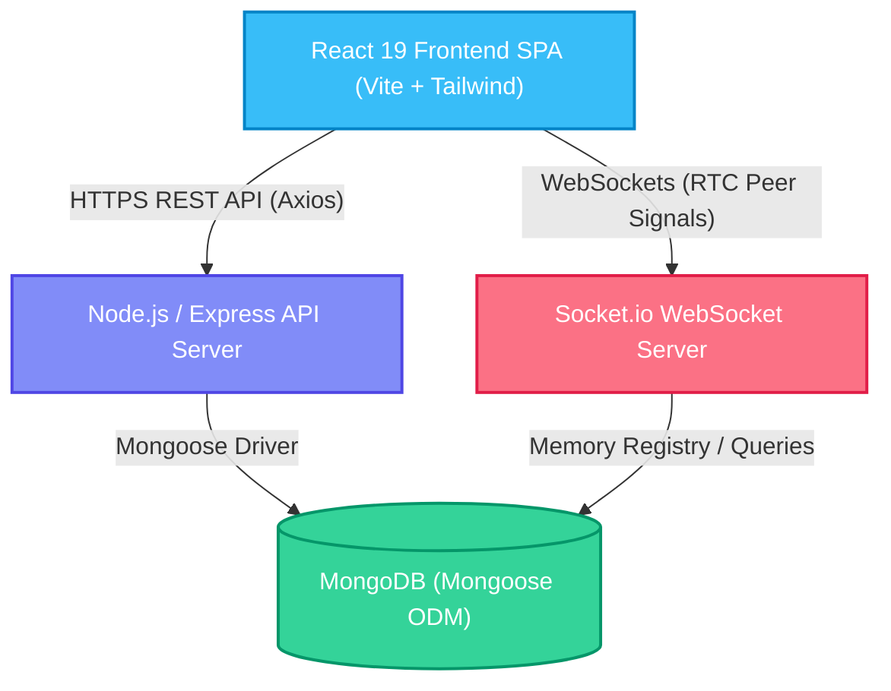
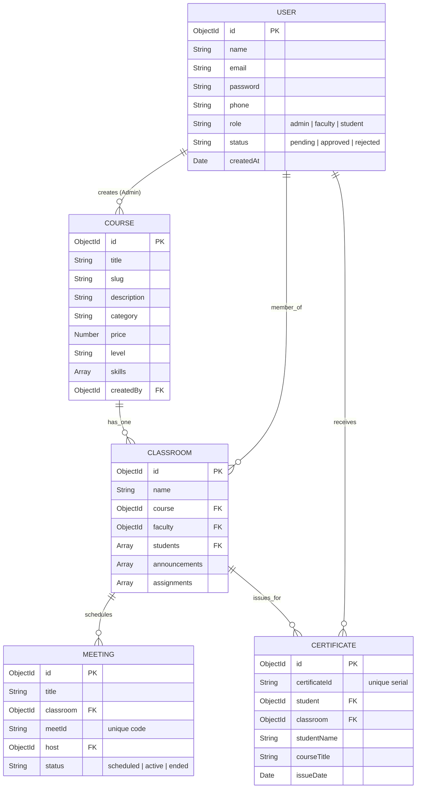
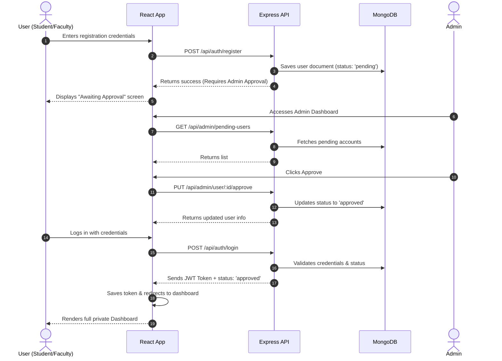
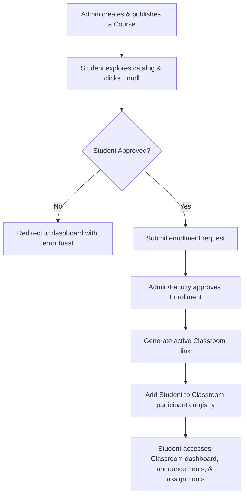
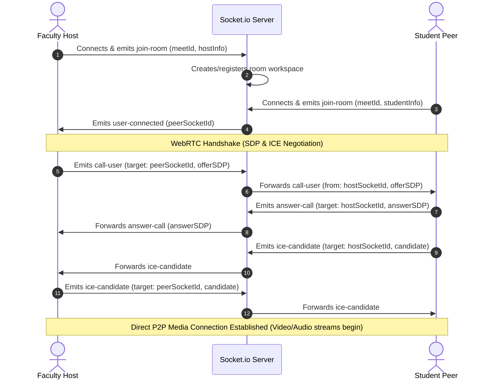

# StuVaradhi - System Architecture & Application Flows

Welcome to the **StuVaradhi** architectural overview. This document provides a detailed walkthrough of the frontend and backend architectures, database modeling, and key application flows. 

---

## 1. High-Level System Architecture

StuVaradhi is built using a modern **Three-Tier Architecture** style utilizing a React Single-Page Application (SPA) on the frontend, an Express/Node.js API and WebSocket server on the backend, and MongoDB as the primary data store.



---

## 2. Component Layers

### A. Frontend Architecture (Client-Side)
The client application is built with **Vite**, **React 19**, and **TailwindCSS**. It has a modular structure organized as follows:
- **`src/main.jsx` & `src/App.jsx`**: Application entry points and global routes utilizing `react-router-dom` (v7).
- **`src/context/`**: Global state management providers:
  - `AuthContext`: Tracks user session, role-based metadata, token expiration, and approval statuses.
  - `ThemeContext`: Toggles dark/light visual modes using Tailwind's dark utility class selectors.
- **`src/components/`**: Reusable visual components:
  - `<SEO>`: Lightweight head tag injector for dynamic search engine indexing.
  - `<ProtectedRoute>`: Restricts route navigation to specific roles (student, faculty, admin) and checks account approval status.
- **`src/pages/`**: View layouts split into `admin/`, `faculty/`, `student/`, `classroom/`, and public routes.
- **`src/services/`**: API query layer powered by `axios`.

### B. Backend Architecture (Server-Side)
The server-side application is a stateless **Node/Express** server utilizing **Socket.io** for WebRTC signalling:
- **`server.js`**: Core entry point that boots Express HTTP routes and establishes the WebSocket Server connection.
- **`config/`**: System properties including database connections and email transporter credentials.
- **`middleware/`**: Request interceptors:
  - `authMiddleware.js`: Validates JWT tokens and applies role-based auth permissions (`admin`, `faculty`, `student`).
- **`routes/`**: URI endpoints mapping routes to business controllers:
  - `authRoutes`, `adminRoutes`, `courseRoutes`, `classroomRoutes`, `meetingRoutes`, `certificateRoutes`.
- **`controllers/`**: Executes business rules, queries databases, and handles HTTP responses.
- **`utils/`**: Shared tools such as admin seed scripts, token generators, and QR builders.

---

## 3. Database Schema Model Relationships

The MongoDB database stores structured datasets managed by **Mongoose ODM**. The key entities and their relationships are highlighted in the ER model diagram below:



---

## 4. Key Application Flows

### A. Authentication & Account Approval Flow
StuVaradhi enforces a gated community model. While any user can register, **Admin Approval** is required for students and faculty to access protected sections of the platform.



---

### B. Course Registration & Classroom Creation Flow
Once courses are created by administrators, approved students can enroll. When an enrollment is approved, a classroom is established linking students to mentors.



---

### C. Live Video Meetings Signalling Flow (Google Meet Replacement)
The live meeting module replaces commercial services by coordinating WebRTC peer-to-peer streams over a custom Socket.io signalling gateway.



---

### D. Certificate Generation & Verification Flow
Students who complete the required deliverables receive an official, cryptographically-verifiable certificate. A verification QR Code on the document links directly back to the public registry.

```mermaid
flowchart LR
    A[Faculty/Admin triggers 'Issue Certificate'] --> B[Server generates Unique Serial ID]
    B --> C[Save Certificate record in DB]
    C --> D[Generate PDF / PNG Template with QR Code]
    D --> E[Email Certificate to Student / Show on Profile]
    E --> F[Employer scans QR Code or visits verify page]
    F --> G[Client fetches verify API endpoint /api/certificates/verify/:id]
    G --> H{Found in DB registry?}
    H -- Yes --> I[Display green "Verified Authentic" badge & credential details]
    H -- No --> J[Display red "Unverified Credential ID" alert]
```

---

## 5. SEO Optimization Architecture

To ensure the public pages of the StuVaradhi platform index correctly in search engines, the following mechanisms are configured:

1. **Static Sitemap (`sitemap.xml`)**: Located in `frontend/public/` to outline indexable public entry points (Home, Courses, About, Contact).
2. **Robots directives (`robots.txt`)**: Commands search engines to crawl public marketing assets while disallowing indexation of private dashboards (`/dashboard`), admin portals (`/admin/`), and classroom workspaces (`/classroom/`).
3. **Dynamic Header Injection (`SEO.jsx`)**: Updates head metadata dynamically based on active router states using a custom React component:
   - Sets page `<title>` dynamically.
   - Adjusts `<meta name="description">` to match page content or database-backed course profiles.
   - Injects Open Graph (OG) and Twitter Card tags to ensure premium visualization during social sharing.
   - Injects **JSON-LD Schema Markup** structured schemas for courses (`Course`) to enable rich snippets directly inside search listings (e.g. price, duration, mentors, curriculum).
